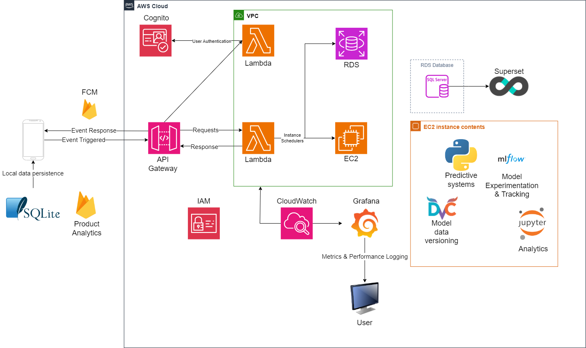

# Audacia

The application is going to be a single-user personalized application that will allow the user to track and keep logs of their health data. The application will be built on the ideas of 

1. Resiliency 
2. Security 
3. Simplicity 

## Solution Architecture (v0.1)
Open to changes in upcoming iterations

